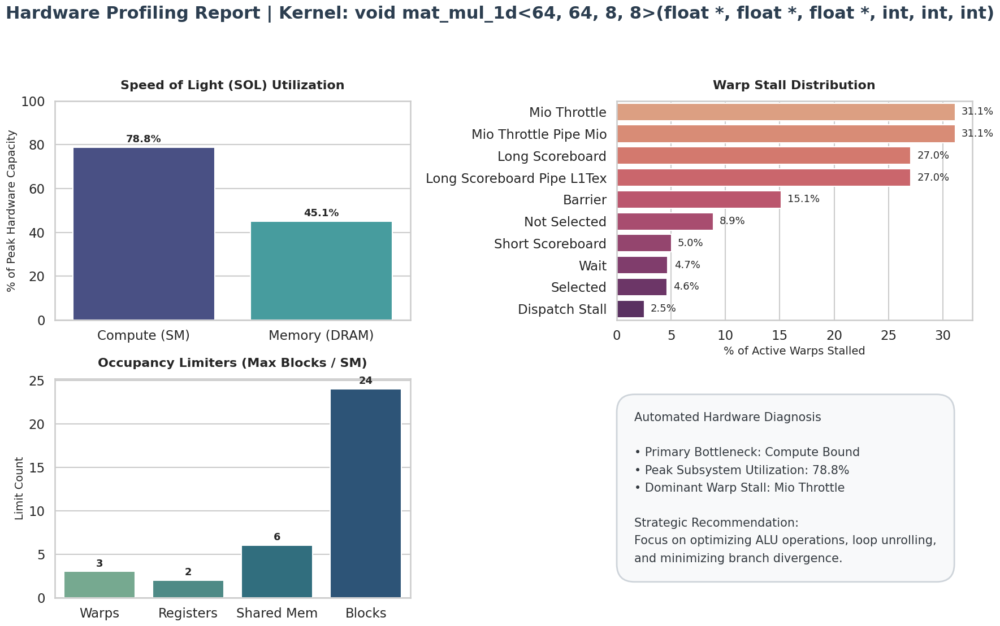
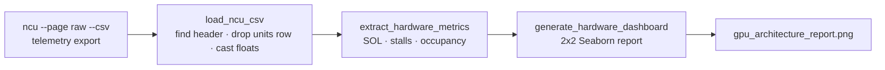

<div align="center">

# 🚀 GPU Microarchitecture & Performance Profiler

### Turn raw NVIDIA Nsight Compute telemetry into a one-page bottleneck report


</div>

---

## 📖 Table of Contents

1. [Overview](#-overview)
2. [Sample Output](#-sample-output)
3. [Case Study: Tiled SGEMM Kernel](#-case-study-tiled-sgemm-kernel)
4. [How It Works](#-how-it-works)
5. [Installation & Usage](#-installation--usage)
6. [Repository Structure](#-repository-structure)
7. [Known Limitations](#-known-limitations)
8. [Roadmap](#-roadmap)

---

## 🔭 Overview

NVIDIA Nsight Compute (`ncu`) exports hundreds of counters per kernel, which is hard to read by eye. This tool ingests that export with **Pandas**, cleans it, extracts the metrics that matter for bottleneck diagnosis, and renders a **2×2 Seaborn dashboard** with an automatic diagnosis box.

| Question it answers | Metric family | Panel |
|---------------------|---------------|-------|
| Is the kernel compute-bound or memory-bound? | Speed of Light (SOL): SM vs DRAM throughput, % of peak | Top-left |
| Why are warps not issuing instructions? | Warp stall reasons (`smsp__warp_issue_stalled_*`) | Top-right |
| What caps how many blocks fit on an SM? | Occupancy limiters (warps, registers, shared memory, blocks) | Bottom-left |
| What should I try next? | Rule-based diagnosis from the numbers above | Bottom-right |

### ✨ Features

- **Robust CSV ingestion:** finds the real header row (`"ID"`) even when application stdout is mixed into the file, drops the units row, and converts thousands-separated strings like `"1,024"` to floats.
- **SOL classification:** compares SM throughput against DRAM throughput to label the kernel *Compute Bound* or *Memory Bound*.
- **Stall ranking:** keeps stall reasons above 1% of active warps, prettifies the metric names, and sorts them.
- **Occupancy breakdown:** shows the per-SM block limit imposed by each hardware resource.
- **Diagnosis engine:** prints the primary bottleneck, peak utilisation, dominant stall, and a suggested optimisation direction.
- **Publication-ready export:** saves the dashboard as a 300 DPI PNG.

---

## 📊 Sample Output



*Generated from a real Nsight Compute capture: 1 kernel record, 333 metrics.*

---

## 🧪 Case Study: Tiled SGEMM Kernel

The sample report profiles `mat_mul_1d<64, 64, 8, 8>`, the 1D block-tiled single-precision matrix multiplication kernel from the companion CUDA kernels project.

**Speed of Light**

| Subsystem | % of peak |
|-----------|----------:|
| Compute (SM) | **78.8%** |
| Memory (DRAM) | 45.1% |

**Warp stall distribution** (% of active warps, stalls above 1%)

| Stall reason | % |
|--------------|--:|
| MIO Throttle | **31.1** |
| Long Scoreboard | **27.0** |
| Barrier | 15.1 |
| Not Selected | 8.9 |
| Short Scoreboard | 5.0 |
| Wait | 4.7 |
| Selected | 4.6 |
| Dispatch Stall | 2.5 |

*(The report also lists "Mio Throttle Pipe Mio" and "Long Scoreboard Pipe L1Tex" bars with identical values; they mirror the rows above and are not additional stalls.)*

**Occupancy limiters** (max blocks per SM allowed by each resource)

| Resource | Limit |
|----------|------:|
| Warps | 3 |
| **Registers** | **2** ← binding limit |
| Shared memory | 6 |
| Blocks | 24 |

### 🔍 What the numbers say

- **Compute is the busiest subsystem (78.8%) and DRAM is only 45.1%**, so the SOL rule labels the kernel *Compute Bound*. The tiling is doing its job of keeping traffic off DRAM.
- **The stalls tell a more nuanced story.** MIO Throttle (31.1%) usually means the memory input/output queue (shared-memory and similar instructions) is saturated, Long Scoreboard (27.0%) means warps are waiting on global-memory data through L1, and Barrier (15.1%) reflects `__syncthreads()` waits in the tiled loop. Together they point to pressure on the shared/L1 memory pipeline rather than on arithmetic units.
- **Registers are the tightest occupancy limiter**: at most **2 blocks per SM** fit, versus 6 for shared memory and 24 for the block limit. Lowering per-thread register use is the first lever for improving latency hiding.

> 💡 This is why the tool shows SOL, stalls and occupancy side by side: SOL alone would have suggested optimising arithmetic, while the stall breakdown points at the memory pipeline.

---

## ⚙️ How It Works



| Stage | Function | What it does |
|-------|----------|--------------|
| 1 | `load_ncu_csv(filepath)` | Scans for the line starting with `"ID"`, reads from there with `skiprows`, removes the units row, strips thousands separators and converts numeric columns |
| 2 | `extract_hardware_metrics(df, kernel_index)` | Pulls SM and DRAM throughput, every `smsp__warp_issue_stalled_*` column ending in `.pct` with value above 1.0, and the four `launch__occupancy_limit_*` columns for one kernel |
| 3 | `generate_hardware_dashboard(...)` | Builds the four panels, annotates the bars, writes the diagnosis box, saves a 300 DPI PNG |

**Diagnosis rule:** `Compute Bound` if SM throughput > DRAM throughput, otherwise `Memory Bound`. The recommendation text is chosen from that label (ALU optimisation and loop unrolling vs coalescing and shared-memory reuse).

---

## 🛠️ Installation & Usage

### 1. Clone and install

```bash
git clone https://github.com/Shrestha-Kumar/ncu-bottleneck-analyzer.git
cd ncu-bottleneck-analyzer
pip install pandas matplotlib seaborn
```

### 2. Profile your CUDA program

```bash
ncu --set full --page raw --csv ./your_cuda_executable > ncu_metrics.csv
```

> The occupancy panel reads `launch__occupancy_limit_*` columns. If you collect only a few metrics (for example just SOL and stall counters), those columns are missing and the occupancy panel will show zeros. Using `--set full` collects them (the sample capture contained 333 metrics).

### 3. Point the script at your CSV and run

Open `script.py` and set the path in the `__main__` block:

```python
csv_file = "ncu_metrics.csv"
```

```bash
python script.py
```

Console output:

```
[1.] Loading and cleaning NCU data from ncu_metrics.csv...
[2.] Successfully loaded 1 kernel records with 333 metrics.
[3.] Extracting microarchitectural metrics...
[4.] Generating hardware analysis dashboard...
[5.] Report successfully saved to gpu_architecture_report.png
```

To analyse a different kernel from a multi-kernel capture, change `kernel_index` in the call to `extract_hardware_metrics`.

`Untitled.ipynb` contains the same pipeline cell by cell for interactive exploration.

---

## 📁 Repository Structure

```
ncu-bottleneck-analyzer/
├── script.py                    # Full pipeline: ingest → extract → dashboard
├── Untitled.ipynb               # Notebook version of the same pipeline
├── gpu_architecture_report.png  # Sample dashboard output
├── .gitignore
└── README.md
```

---

## ⚠️ Known Limitations

1. **One kernel per run.** The dashboard analyses a single row (`kernel_index`, default 0); there is no loop over all kernels or comparison across kernels yet.
2. **Simple diagnosis rule.** Comparing SM against DRAM throughput can label a kernel *Compute Bound* even when stalls point at the memory pipeline, as in the case study. Treat the recommendation box as a starting hint and read it together with the stall panel.
3. **Duplicate stall bars.** Some NCU stall sub-metrics report the same value as their parent, so two bars can appear with identical numbers (see the case study note).
4. **Occupancy panel shows raw limits.** The tightest limiter is not highlighted automatically; read the smallest bar (Registers = 2 in the case study).
5. **Hard-coded CSV path.** The path lives in the `__main__` block and must be edited per run.
6. **Metric names can differ across Nsight Compute versions**, so some columns may need adjusting for older or newer releases.

---

## 🔮 Roadmap

- [ ] Command-line arguments for input CSV, output path and kernel index (`argparse`)
- [ ] Batch mode: one report row per kernel, with a ranked summary table
- [ ] Roofline plot using arithmetic intensity
- [ ] Highlight the binding occupancy limiter and de-duplicate stall bars
- [ ] Richer diagnosis rules that combine SOL, stalls and occupancy

---

<div align="center">

**Built by [Shrestha Kumar](https://github.com/Shrestha-Kumar)** · IIT Mandi

</div>
